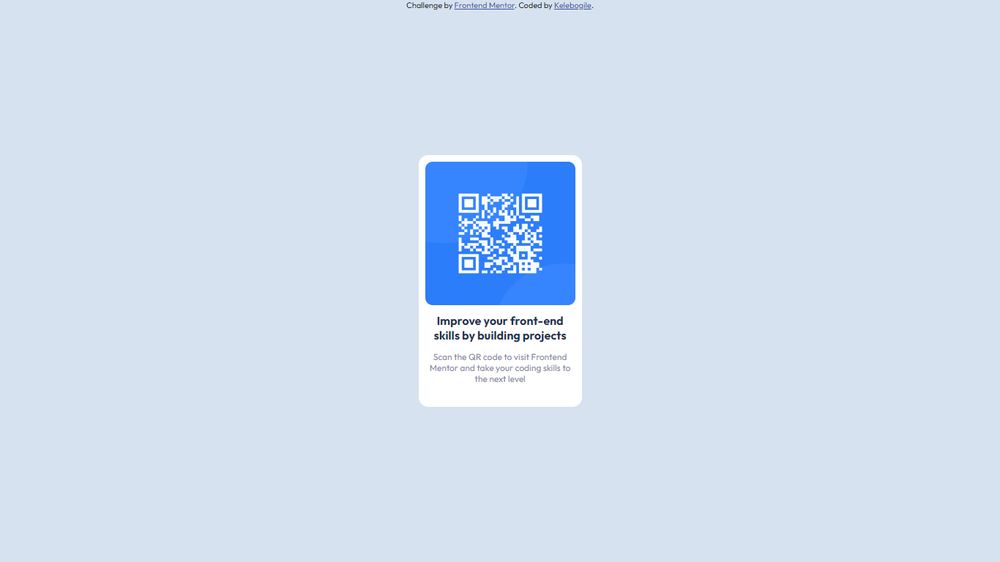

# Frontend Mentor - QR code component solution

This is a solution to the [QR code component challenge on Frontend Mentor](https://www.frontendmentor.io/challenges/qr-code-component-iux_sIO_H). Frontend Mentor challenges help you improve your coding skills by building realistic projects. 

## Table of contents

  - [Overview](#overview)
  - [Screenshot](#screenshot)
  - [Links](#links)
  - [My process](#my-process)
  - [Built with](#built-with)
  - [What I learned](#what-i-learned)
  - [Continued development](#continued-development)
  - [Author](#author)

## Overview

### Screenshot




### Links

- Live Site URL: [Add live site URL here](http://127.0.0.1:5501/qr-code-component-main/index.html)

## My process
In order to create a card, I first created a div container in HTML. I then added the paragraphs and headers that I wanted to appear inside the card to the container. Using CSS, I styled the text to be in the center of the page, adjusted the widths, and added background colors. 

### Built with

- Semantic HTML5 markup
- CSS custom properties


### What I learned
I've learnt more about making cards and decorating the page to match the requirements.


Use this section to recap over some of your major learnings while working through this project. Writing these out and providing code samples of areas you want to highlight is a great way to reinforce your own knowledge.

To see how you can add code snippets, see below:

```html
<div class="card">
  <div class="content">

  <h1>Improve your front-end skills by building projects</h1>
<p > Scan the QR code to visit Frontend Mentor and 
  take your coding skills to the next level</p>

    </div>
  </div>
 ```

### Continued development
The area I am working on improving is appropriately measuring content widths.


## Author
- Frontend Mentor - [@Kele24](https://www.frontendmentor.io/profile/Kele24)
- Linkedin - [@Kelebogile Mothoagae](https://www.linkedin.com/in/kelebogile-mothoagae-7ab4b71b7/)


